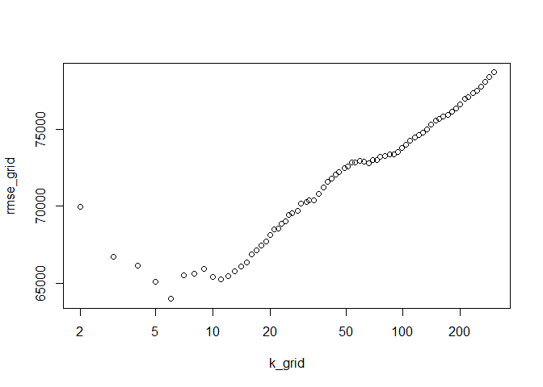

Saratoga House Prices
---------------------

Here, we are looking to model house prices using the Saratoga data set.
In the base or medium model, we included all variables except for sewer,
waterfront, landValue, and newConstruction. This model also does not
include any interaction variables.

    lm_med = lm(price ~ . - sewer - waterfront - landValue - newConstruction, data=saratoga_train)

To build on this model and make it more accurate, I added interaction
variables and previously excluded variables and removed some of the
weaker variables such as fuel. I found this model to be much more
accurate in predicting prices since the RMSE is much lower

    lm_big = lm(price ~ lotSize + age +landValue + waterfront + newConstruction 
                + rooms*heating + rooms*bedrooms*bathrooms + livingArea, data=saratoga_train)

When using this particular model, I found that the largest drivers of
price follows our general intuition. The top three variables are
newConstruction, bedrooms, and bathrooms. This is to be expected as
these variables generally mean a larger house, and thus a higher price.

Now transitioning to the KNN model, I found that it performs similarly
in terms of RMSE at the optimal K value which hovers bewteen 7-10. On
average the RMSE floats for this model isbewteen 55,000 and 58,000.

Overall, the models here are still relatively simple and both have
simliar performance over many differesnt test splits.

Hospital Audit
--------------

Question 1 : Are some radiologists more clinically conservative than
others in recalling patients, holding patient risk factors equal?

To explore this question, I first subsetted the data by radiologist. I
did this to train the each regression model to the particular
radiologist. Next we then use a test split of the entire data set to
predict the probabilities of recalls. AFter runnning the a series of
tests splits here are the recall probabilities for each radiologist:

    ## Radiologist13 Radiologist34 Radiologist66 Radiologist89 Radiologist95 
    ##    0.13859842    0.08735414    0.19059836    0.20667511    0.12659556

Here we define the radiologist with higher probability to be more
conservative, so from our regression analysis,Radiologist85 is the most
conservative of the five doctors.

Question 2 : when the radiologists at this hospital interpret a
mammogram to make a decision on whether to recall the patient, does the
data suggest that they should be weighing some clinical risk factors
more heavily than they currently are?

We first run two models of regression. Model A is simply regressing
cancer outcome on the doctor's recall decision. Model B adds the varying
clinical risk factors such as age and history. A and B follow,
respectively :

    cancer_reg = lm(cancer ~ recall, data=brca_train)
    cancer_reg = lm(cancer ~. -radiologist, data=brca_train)

Using test splits and finding the average RMSE, I found the data does
not indicate that Model B performs better. This seems counter intuitive,
as a model that includes risk factor would seem to be more accurate in
predicting cancer. The largest factors from Model B were age, and
density.

Predicting when articles go viral
---------------------------------

I first try to regress the data, and then threshold the predictive
sharses results into viral or not. Here is the corresponding model.

     share_reg= lm(shares ~ n_tokens_title*num_hrefs*n_tokens_content*num_self_hrefs + num_imgs*num_videos 
                               + title_sentiment_polarity*avg_positive_polarity*avg_negative_polarity + data_channel_is_lifestyle + data_channel_is_entertainment 
                                + data_channel_is_bus + data_channel_is_socmed + data_channel_is_tech + data_channel_is_world,data= online_train)

After running over many test splits, I found the following confusion
matrix and corresponding rates.

    ##    yhat
    ## y      0    1
    ##   0 3249  783
    ##   1    2 3895

    ## Error Rate    FP Rate    TP RAte 
    ##  0.5043272  0.9896032  0.9942667

Now, I try the opposite order. We first threshold the articles into
viral or not, and then run a predictive model. I used a logit model
while holding all the independent variables the same. The results of the
logit model:

    ##    yhat
    ## y      0    1
    ##   0 2263 1691
    ##   1 1077 2898

    ## Error Rate    FP Rate    TP RAte 
    ##  0.3571674  0.4411939  0.7289614

Clearly, we see that the original linear model performs abysmally. error
rate is quite high while FP and TP are in the 90% range. This model is
absolutely useless. However, when thresholding the model first, I found
that the logit model performs quite reasonably. TP and FP fluctuate
depending on your classification level, but the error rate remains
relatively low. Thresholding first likely yields better resutls in this
case, as we guide the models to look for"viral" articles.
