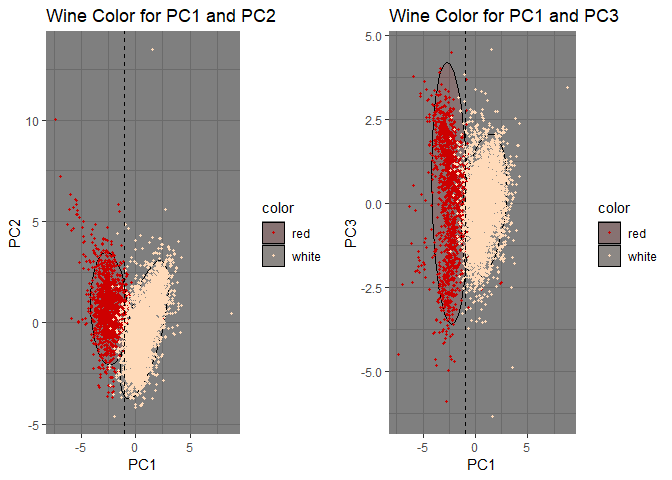
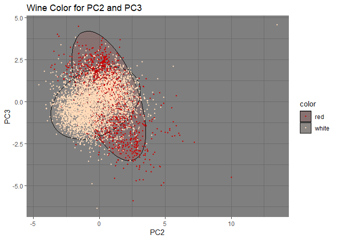
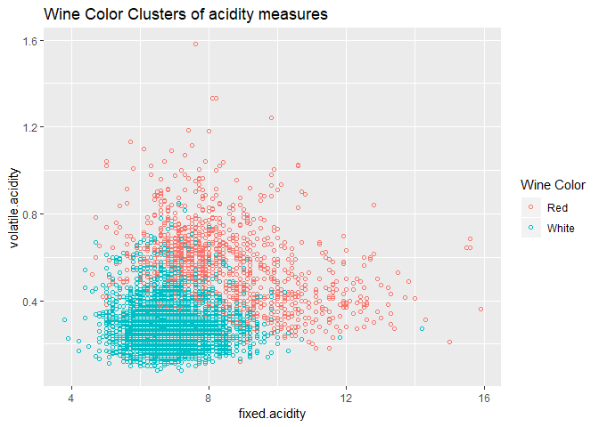
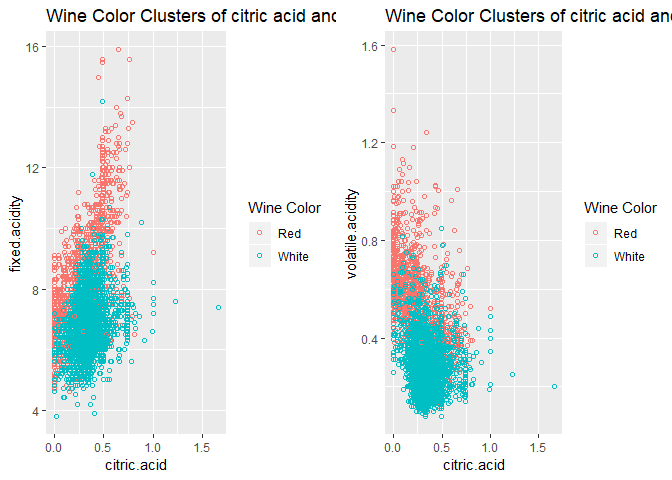

Part 1
------

### PCA

I first look to run Principal Component Analysis (PCA) on the data. The
goal of PCA here is to find low-dimensional summaries that will allow us
to further understand the dataset.

Here I look to visualize the first 3 PCA components and attempt to see
whether there are groupings in wine color or wine quality.

For principal components 1 and 2, we can see that there is a clear
grouping for wine color around the intercept -1 of PC1, and the graph of
PC1 and PC3 follows the same trend. However when looking below at PC2
and PC3, there is no definite groupings in terms of wine color.

Now we look to see if there are any groupings for wine quality. This
will likely be very diffficult to dp since wine quality ranges from 3-9,
so I decided to index the quality into three groups: low, medium, and
high. Low being 3-4, medium being 5-6, and high being 7-9. There are
still no clear distinct groupings, but there looks to be a larger number
of medium and high wines on the positive end of PC1.

### Clustering

In this part, we look to use clustering to reduce the dimensionality of
the dataset. We begin by scaling and centering our wine dastaset, and
then running the k-means with 2 clusters.

    cluster <- kmeans(wine_scale, centers=2, nstart=50)

We then use the two clusters created to find the groupings of wine color
in graphs of various variables. First lets look at the different
measures of acidity.

Similarly, we can look at citric acid against both these different
measures.

Overall, both of these dimension reducing methods give a good way of
dividing by wine color which is a binary categorization. In terms of
finding groupings by wine quality, it is much harder to do.
