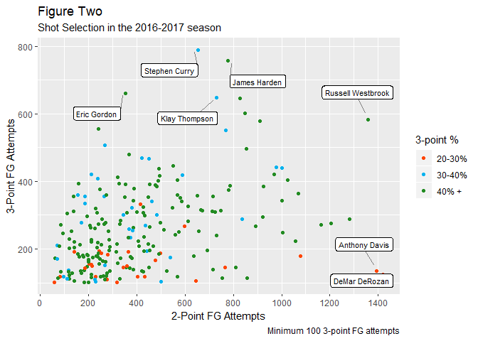

Abstract
========

In this report, I summarize the overall trends of the 3-point attempts
starting from 1980 to 2017. With the 3-point shot being introduced in
1979, we have seen an increase in volume from 1980 to 2017 at astounding
rates, even with the multiple expansion years. In the most recent season
of the data set ,2017, we see four out of the five prolific shooters,
being on two of the winningest teams in the league, GSW being first and
HOU placing third. From our predicitve model, I got an astoundingly low
RMSE at **47.73**. The model predicts linearly with the training data
set, which is a positive sign for its overall predicitive powers. Among
the predictions, the 3-point attempts can be seen rising steadily over
the years, and this trend will likely continue with the likes of James
Harden, Klay Thompson, and Steph Curry at the forefront.

Introduction
============

In today's age of basketball, we've all heard of the names of prolific
3-point shooters such as Steph Curry, Klay Thompson, and James Harden,
and the wave of 3-point shooting that has accompanied them. Harden in
particular has been indoctrinated into a system revolving around this
shot. The Houston Rockets, a home town favorite of mine, are notorious
around the league for pushing the envelope of this new 3-point movement,
in which they have dropped the midrange 2-point shot from their
repertoire in favor of the more efficient 3-point shot.

Teams have not alwasy been so reliant on this particular shot or even
had the opportunity for it. Surprising to many, the 3-point shot was
only introduced to the NBA in the 1979 season, and other governing
basketball bodies such as FIBA, Olypmics, and NCAA followed suit in the
next few years. The NBA since then has tried to tinker with the distance
of the shot to increase and decrease scoring, but today it is at the
original 23 feet and 9 inches around the arc while being 22 ft. from the
corners.

But where will all this lead? Has the likes of Steph Curry and James
Harden ushered in a new era of basketball dependent on the 3-point shot?
Here we will examine this increase in volume of 3-point shots using
other advanced basketball metrics.

Methodology
===========

The data set used here was obtained through Kaggle, but it is a
aggregated dataset of players from 1950-2017 scraped from
basketball-reference.com. The data includes the typical box-score stats
such as points, assists, and rebounds to advanced features such as PER
and true shooting percentages.

To examine the trends using data visualizations, I began by mutating the
data and finding summary variables typically by year or team. I wanted
to look at the overall trend from the 80's until 2017 as well as 2017 by
itself. It's important to note how the league first started with the
3-point shot, and how players are choosing their shots in the modern
era.

For my prediction model, I begin by subsetting the data by years after
1979 where the NBA introduced the 3-point line. From their I look into
other correlation and trends that may be interesting. Here, I start with
teams and years and then move towards basketball metrics. The main
statistic that I am looking at is X3PA or 3-point attempts. I wanted a
baseline of some of the more "proflific" shooters, so i subsetted the
data once again by X3PA &gt;= 100. This removes a majority of bench or
role players that may put up only a few shots a season. After subsetting
twice, I end up with 4432 observations.

I wanted to use something we recently learned to be quite powerful,
**trees**. For this purpose, I removed all of the advance basketball
metrics like PER amd TS%. I believe while these are interesting to look
at they would be confounding in this model.I aslo looked to remove
3-points made, 2-points made, and free throws made, while keeping
attempts and percentages for each of these. I then use Principle
Components Analysis (PCA) to generate five additional variables that
will help the tree find the proper nodes. With these componenets, I have
a total of 22 variables to run the tree on.

Now for our cleaned dataset, I will run the tree, find the best
complexity parameter, and prune the tree using this complexity
parameter.

Results and Analysis
====================

The basic trend noted earlier that 3-point shot volume has increased in
the past 3 decades is clearly seen in Figure 1. From the introduction of
the shot to 2017, volume has increased by nearly 12 times. It is to be
noted that, in 1980 there were only 23 teams, compared to the modern era
of 30 teams. Despite the difference in number of teams, this pace is
still astounding. the largest. The three season spike in the 90's was
likely due to efforts by the NBA to increase scoring by decreasing the
3-point distance. In the following year, it was returned to its original
distance, and the 3-point trend continues to climb up.

Next we look turn to look at the most recent year in Figure Two. When we
look at the highlighted names towards the top of 3-point FG attempts, we
see that four out of five of these players are on the **same** team.
What also sticks out is a player like Demar Derozan, a shooting guard,
leading this group in 2-point FG attempts. In this day and age, it'd
almost be absurd to take this many two's at his position.

Moving on to the predictive model portion, after generating a big tree,
and pruning it down. The model RMSE is at an exceptionally low 47.73.
I'm not too sure why it's so low, perhaps the additions of PCA really
help drive the tree and it's predictive powers. The most notable figure
derived from the tree is Figure 3. Here we see a defintie increase in
predicted 3-point attempts over the past decades. This trend is likely
to continue for the foreseeable future.

Next we have the predicted values plotted against the actual training
set value. I use this to see the validity and linearity of the model.
This linearity of the plot is generally a good sign in terms of
predicitve value as one would wnat their predicted values to align with
the training data.

